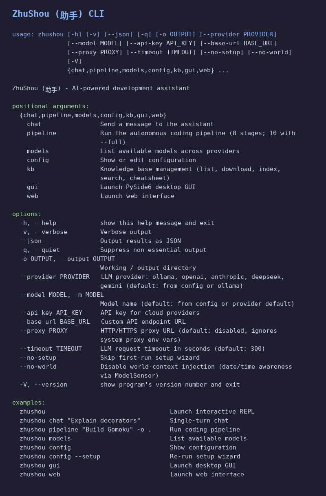

# ZhuShou (助手) - AI 驱动的开发助手

一个 AI 驱动的开发助手，支持多模型 LLM、三种界面（CLI、桌面 GUI、Web）、自主 8 阶段编程流水线、三层记忆系统、世界感知能力、网页文档爬取和持久化配置。

## 功能特点

- **多提供商 LLM 支持** - Ollama、OpenAI、Anthropic、DeepSeek、Gemini、LM Studio、vLLM
- **交互式 REPL** - 流式响应和斜杠命令
- **11 个内置工具** - 文件读写编辑、Shell 命令、glob、grep、搜索、git 操作
- **8 阶段自主编程流水线** - 需求、架构、任务、函数设计、实现、测试、调试、验证（使用 `--full` 扩展为 10 阶段）
- **桌面 GUI** - 基于 PySide6，实时流水线可视化、语法高亮代码查看器、Catppuccin Mocha 暗色主题
- **Web 界面** - FastAPI + 原生 JS，地址 `http://127.0.0.1:8765`，通过 WebSocket 实时事件推送，无需构建步骤
- **首次运行设置向导** - 自动发现 Python 解释器，引导选择提供商和模型（CLI 和 GUI 模式）
- **持久化配置** - 设置存储在 `~/.zhushou/config.json`，CLI 参数始终覆盖存储的值
- **事件驱动架构** - 线程安全的发布/订阅事件总线，13 种事件类型驱动实时 UI 更新
- **知识库** - 下载、索引和搜索框架文档；内置速查表；通过 `--kb` 注入流水线上下文
- **世界感知能力** - 通过 ModelSensor 将实时日期/时间/时区注入 LLM 提示词（可配置，使用 `--no-world` 禁用）
- **网页文档爬取** - 使用 Huan 将任意网站爬取到知识库（`zhushou kb crawl <url>`）
- **三层记忆系统** - 持久化 JSON 键值存储、JSONL 对话日志、ChromaDB 向量搜索
- **上下文窗口管理** - 使用超过 80% 预算时自动压缩
- **Token 追踪和成本估算** - 按提供商/模型计算
- **Persona 配置** - 通过 Markdown 文件自定义
- **兄弟工具发现** - 集成 Chou、GangDan、Huan、Liao、NuoYi、CopyTalker、LaPian 的工具
- **.git 目录保护** - 拒绝修改 git 内部文件

## 环境要求

- Python >= 3.10
- httpx（必需）
- rich（必需）
- modelsensor（必需，世界感知能力）
- huan（必需，网页文档爬取）

可选依赖：
- PySide6（桌面 GUI）
- FastAPI + uvicorn（Web 界面）
- ChromaDB（向量搜索）

## 安装

### 从 PyPI 安装

```bash
pip install zhushou
```

### 从源码安装

```bash
git clone https://github.com/cycleuser/ZhuShou.git
cd ZhuShou
pip install -e .
```

### 安装可选依赖

```bash
# 安装向量搜索支持
pip install zhushou[vector]

# 安装特定 LLM 提供商
pip install zhushou[openai]
pip install zhushou[anthropic]
pip install zhushou[gemini]

# 安装桌面 GUI（PySide6）
pip install zhushou[gui]

# 安装 Web 界面（FastAPI + uvicorn）
pip install zhushou[web]

# 安装全部依赖
pip install zhushou[all]
```

## 快速开始

安装后，`zhushou` 命令即可使用：

```bash
# 启动交互式 REPL
zhushou

# 单轮对话
zhushou chat "解释 Python 装饰器"

# 运行 8 阶段自主流水线
zhushou pipeline "开发一个五子棋游戏" -o ./output

# 运行完整 10 阶段流水线（添加文档 + 打包阶段）
zhushou pipeline "用 Flask 开发一个 API" --full -o ./api

# 使用知识库上下文运行流水线
zhushou pipeline "用 Flask 开发一个 API" --kb flask -o ./api

# 启动桌面 GUI
zhushou gui

# 启动 Web 界面
zhushou web

# 列出可用模型
zhushou models

# 显示配置
zhushou config

# 重新运行设置向导
zhushou config --setup

# 知识库管理
zhushou kb list

# 下载框架文档
zhushou kb download numpy

# 爬取网站到知识库
zhushou kb crawl https://docs.example.com --max-pages 100

# 显示版本
zhushou -V
```

## 使用方法

```bash
zhushou [选项] [命令]
```

### 全局选项

| 选项 | 简写 | 说明 |
|------|------|------|
| `--version` | `-V` | 显示版本 |
| `--verbose` | `-v` | 详细输出 |
| `--json` | | 以 JSON 格式输出结果 |
| `--quiet` | `-q` | 静默模式 |
| `--output DIR` | `-o` | 工作/输出目录 |
| `--provider` | | LLM 提供商（默认：ollama） |
| `--model` | `-m` | 模型名称 |
| `--api-key` | | 云服务 API 密钥 |
| `--base-url` | | 自定义 API 端点 URL |
| `--proxy` | | HTTP/HTTPS 代理 URL（默认：禁用） |
| `--timeout` | | LLM 请求超时时间（秒，默认：300） |
| `--no-setup` | | 跳过首次运行设置向导 |
| `--no-world` | | 禁用世界感知（日期/时间注入） |

### 子命令

| 命令 | 说明 |
|------|------|
| `chat` | 向助手发送消息 |
| `pipeline` | 运行 8 阶段自主编程流水线（使用 `--full` 扩展为 10 阶段） |
| `models` | 列出各提供商的可用模型 |
| `config` | 显示配置；`--setup` 重新运行向导 |
| `gui` | 启动 PySide6 桌面 GUI |
| `web` | 启动 Web 界面（`--port`、`--host`） |
| `kb` | 知识库管理（list、download、index、search、crawl） |

### 交互式 REPL 命令

| 命令 | 说明 |
|------|------|
| `/help` | 显示可用命令 |
| `/quit` 或 `/exit` | 退出 REPL |
| `/clear` | 清除对话历史 |
| `/stats` | 显示 Token 使用统计 |

## LLM 提供商

| 提供商 | 键名 | 说明 |
|--------|------|------|
| Ollama | `ollama` | 本地运行，免费，默认 |
| OpenAI | `openai` | 需要 API 密钥 |
| Anthropic | `anthropic` | 需要 API 密钥 |
| DeepSeek | `deepseek` | 需要 API 密钥 |
| Gemini | `gemini` | 需要 API 密钥 |
| LM Studio | `lmstudio` | 本地运行，OpenAI 兼容 |
| vLLM | `vllm` | 本地运行，OpenAI 兼容 |

```bash
# 使用 Ollama（默认）
zhushou --provider ollama --model llama3

# 使用 OpenAI
zhushou --provider openai --api-key sk-... --model gpt-4o

# 使用 DeepSeek
zhushou --provider deepseek --api-key sk-...

# 使用自定义端点
zhushou --provider openai --base-url http://localhost:8080/v1
```

## 桌面 GUI

启动基于 PySide6 的桌面 GUI，获得图形化流水线体验：

```bash
pip install zhushou[gui]
zhushou gui
```

GUI 提供编程流水线的实时视图，采用 Catppuccin Mocha 暗色主题：

- **顶部栏** - 请求文本输入框、运行/停止按钮、提供商和模型状态
- **阶段侧边栏**（左侧，200-280px）- 流水线阶段进度及状态指示器：
  - ○ 等待中  ● 运行中  ✓ 已完成  ✗ 错误
- **代码面板**（右上方，约 60%）- 文件列表和语法高亮的 Python 代码查看器
- **思考面板**（右下方，约 40%）- 实时 LLM 推理、工具调用、测试结果
- **状态栏** - 提供商、模型、已用时间

首次启动时，**设置向导对话框** 将引导你完成 4 个步骤：Python 解释器选择、LLM 提供商选择、API 密钥输入（本地提供商如 Ollama 会跳过）和模型选择。

## Web 界面

启动 FastAPI Web 界面，通过浏览器访问：

```bash
pip install zhushou[web]
zhushou web [--port PORT] [--host HOST]
```

默认地址：`http://127.0.0.1:8765`

Web 界面提供与桌面 GUI 相同的分栏布局（侧边栏 + 代码面板 + 思考面板），使用相同的 Catppuccin Mocha 暗色主题。通过 WebSocket 实时推送更新。无需构建步骤——前端使用原生 HTML/CSS/JS，由 FastAPI 直接提供服务。

### API 端点

| 端点 | 方法 | 说明 |
|------|------|------|
| `/api/config` | GET | 当前配置（API 密钥已脱敏） |
| `/api/providers` | GET | 可用 LLM 提供商 |
| `/api/models` | GET | 当前提供商的可用模型 |
| `/api/world` | GET | 世界感知信息（ModelSensor 日期/时间） |
| `/api/pipeline` | POST | 启动流水线运行（`{"request": "..."}`） |
| `/api/kb/crawl` | POST | 爬取网站到知识库（`{"url": "..."}`） |
| `/ws` | WebSocket | 实时事件流 |

## 配置与设置向导

ZhuShou 将配置存储在 `~/.zhushou/config.json`。首次启动时，设置向导自动运行以配置：

1. **Python 解释器** - 自动从 PATH、pyenv 和 conda 环境中发现解释器
2. **LLM 提供商** - 从可用提供商中选择（Ollama、OpenAI、Anthropic 等）
3. **API 密钥** - 输入云服务提供商的 API 密钥（本地提供商跳过此步骤）
4. **模型** - 从提供商的可用模型列表中选择

重新运行向导：`zhushou config --setup`

跳过向导：`zhushou --no-setup`

CLI 参数始终覆盖存储的配置值。

| 字段 | 说明 | 默认值 |
|------|------|--------|
| `python_path` | Python 解释器路径 | （自动检测） |
| `provider` | LLM 提供商 | `ollama` |
| `model` | 模型名称 | （设置时选择） |
| `api_key` | 云服务 API 密钥 | （空） |
| `base_url` | 自定义 API 端点 | （空） |
| `proxy` | HTTP 代理 URL | （空） |
| `timeout` | 请求超时时间（秒） | `300` |
| `world_sense` | 启用世界感知注入 | `true` |

## 自主编程流水线

8 阶段流水线从文本描述生成完整项目：

1. **需求分析** - 分析请求，生成规格说明
2. **架构设计** - 设计文件结构、模块布局，搭建项目脚手架
3. **任务拆解** - 创建有序的实现任务列表
4. **函数设计** - 详细的函数级签名和依赖关系
5. **代码实现** - 逐文件编写代码
6. **测试生成** - 生成并运行测试
7. **调试修复** - 修复失败的测试（最多 5 次重试，含验证-调试反馈循环）
8. **最终验证** - 最后检查、导入验证和总结报告

使用 `--full` 可添加两个额外阶段：

9. **文档生成** - 生成 README.md、README_CN.md、requirements.txt
10. **打包发布** - 生成 pyproject.toml、上传脚本、帮助截图生成器

```bash
# 标准 8 阶段流水线
zhushou pipeline "用 Flask 开发一个 REST API" -o ./my_api

# 完整 10 阶段流水线
zhushou pipeline "开发一个五子棋游戏" --full -o ./game

# 使用知识库上下文的流水线
zhushou pipeline "用 Flask 开发一个应用" --kb flask -o ./app
```

## 知识库

下载、索引和搜索官方框架文档，用作流水线上下文：

| 命令 | 说明 |
|------|------|
| `zhushou kb list` | 列出可用的文档源及其下载/索引状态 |
| `zhushou kb download <source>` | 下载指定框架的官方文档 |
| `zhushou kb index <source>` | 将已下载的文档索引到向量数据库 |
| `zhushou kb search <query>` | 搜索已索引的知识库 |
| `zhushou kb cheatsheet <name>` | 显示内置速查表 |
| `zhushou kb crawl <url>` | 爬取网站到知识库（通过 Huan） |

通过 `--kb` 标志将知识库上下文注入流水线运行：

```bash
zhushou pipeline "开发一个数据可视化应用" --kb numpy matplotlib -o ./viz
```

### 网页文档爬取

使用 Huan 将任意网站爬取到知识库：

```bash
# 爬取文档站点
zhushou kb crawl https://docs.flask.palletsprojects.com --name flask-docs

# 限制页面数量并限定路径前缀
zhushou kb crawl https://docs.python.org --max-pages 50 --prefix /3/library/

# 爬取的内容自动索引，可通过 --kb 或 kb search 使用
zhushou kb search "Flask 路由"
```

## 记忆系统

ZhuShou 提供三层持久化记忆：

| 层级 | 存储 | 用途 |
|------|------|------|
| 持久化 KV | `~/.zhushou/memory.json` | 事实、偏好、项目元数据 |
| 对话日志 | `~/.zhushou/logs/{日期}.jsonl` | 每日完整消息历史 |
| 向量搜索 | ChromaDB（可选） | 过往对话的语义搜索 |

## Persona 配置

通过创建 persona 文件自定义助手行为：

```bash
# 项目本地 persona
mkdir -p .zhushou
cat > .zhushou/persona.md << 'EOF'
# Identity
你是一位资深 Python 开发者，专注于数据科学。

# Rules
- 始终使用类型提示
- 优先使用 pandas 而非原始循环

# Tools
- 使用 python_exec 进行快速计算
EOF
```

搜索顺序：`.zhushou/persona.md` -> `~/.zhushou/persona.md` -> 内置默认值。

## 项目结构

```
ZhuShou/
├── zhushou/                # 主包
│   ├── config/            # 持久化配置
│   │   ├── manager.py         # ZhuShouConfig 数据类 + JSON 读写
│   │   └── wizard.py          # 首次运行设置向导（CLI + GUI）
│   ├── events/            # 事件系统
│   │   ├── types.py           # 13 个冻结事件数据类
│   │   └── bus.py             # 线程安全的 PipelineEventBus
│   ├── gui/               # 桌面 GUI（PySide6）
│   │   ├── app.py             # 应用入口
│   │   ├── main_window.py     # 主窗口（1400x850）
│   │   ├── pipeline_view.py   # 分栏视图容器
│   │   ├── stage_sidebar.py   # 阶段进度侧边栏
│   │   ├── code_panel.py      # 文件列表 + 语法高亮查看器
│   │   ├── thinking_panel.py  # LLM 推理显示
│   │   ├── wizard_dialog.py   # 设置向导对话框（4 页）
│   │   ├── workers.py         # QThread 流水线工作线程 + EventBridge
│   │   └── styles.py          # Catppuccin Mocha 主题 + QSS
│   ├── web/               # Web 界面（FastAPI）
│   │   ├── app.py             # FastAPI 工厂 + uvicorn 启动器
│   │   ├── routes.py          # REST + WebSocket 端点
│   │   ├── bridge.py          # 事件总线 -> WebSocket 桥接
│   │   └── static/            # 原生 JS 前端
│   │       ├── index.html
│   │       ├── style.css
│   │       └── app.js
│   ├── llm/               # LLM 提供商抽象层
│   │   ├── base.py             # BaseLLMClient 抽象类 + 数据类
│   │   ├── ollama_client.py    # Ollama 提供商
│   │   ├── openai_client.py    # OpenAI / DeepSeek / LM Studio
│   │   ├── anthropic_client.py # Anthropic
│   │   ├── gemini_client.py    # Google Gemini
│   │   ├── factory.py          # LLMClientFactory
│   │   └── model_registry.py   # 上下文窗口和定价信息
│   ├── executor/          # 工具执行器
│   │   ├── tool_executor.py    # 沙箱化调度器
│   │   ├── builtin_tools.py    # 11 个内置工具
│   │   └── sibling_tools.py    # 兄弟包发现
│   ├── agent/             # 核心代理循环
│   │   ├── loop.py             # 交互式 REPL + 工具循环
│   │   ├── context.py          # 上下文窗口管理
│   │   └── conversation.py     # 对话缓冲区
│   ├── memory/            # 三层记忆
│   │   ├── persistent.py       # JSON 键值存储
│   │   ├── conversation_log.py # JSONL 日志
│   │   └── vector_store.py     # ChromaDB / numpy 回退
│   ├── knowledge/         # 知识库子系统
│   │   ├── kb_manager.py       # 高层门面
│   │   ├── kb_config.py        # 知识库配置
│   │   ├── doc_sources.py      # 官方文档源定义
│   │   ├── doc_manager.py      # 文档下载器
│   │   ├── indexer.py          # 向量数据库索引器
│   │   ├── retriever.py        # RAG 搜索
│   │   └── cheatsheets.py      # 内置速查表
│   ├── pipeline/          # 自主流水线
│   │   ├── stages.py           # 8 个核心 + 2 个完整模式阶段
│   │   ├── orchestrator.py     # 流水线运行器（含事件发射）
│   │   └── function_design.py  # 函数级设计解析器
│   ├── display/           # Rich 控制台输出
│   ├── persona/           # Persona 加载器
│   ├── tracking/          # Token 使用追踪
│   ├── git/               # Git 操作
│   ├── utils/             # 工具函数
│   │   ├── constants.py        # 项目常量
│   │   ├── python_finder.py    # 多源 Python 发现
│   │   └── world_context.py    # ModelSensor 世界感知助手
│   ├── api.py             # 统一 Python API
│   ├── tools.py           # OpenAI 函数调用格式
│   └── cli.py             # CLI 入口
├── tests/                 # pytest 测试
├── old/                   # 原始原型
├── pyproject.toml         # 包配置
├── README.md              # 英文文档
└── README_CN.md           # 本文件
```

## 开发

```bash
# 安装开发依赖
pip install -e ".[dev]"

# 运行测试
pytest

# 详细输出
pytest -v
```

## Python API

```python
from zhushou import chat, run_pipeline, search_pypi

# 单轮对话
result = chat("解释列表推导式", provider="ollama", model="llama3")
print(result.success)   # True / False
print(result.data)      # 助手回复文本

# 运行自主流水线
result = run_pipeline("开发一个计算器应用", output_dir="./calc")
print(result.data)      # 流水线统计信息

# 搜索 PyPI
result = search_pypi("requests")
print(result.data)      # 包信息列表
```

## Agent 集成（OpenAI Function Calling）

ZhuShou 提供 OpenAI 兼容的工具定义，可供 LLM Agent 调用：

```python
from zhushou.tools import TOOLS, dispatch

# 将 TOOLS 传入 OpenAI chat completion API
response = client.chat.completions.create(
    model="gpt-4o",
    messages=messages,
    tools=TOOLS,
)

# 分发工具调用
result = dispatch(
    tool_call.function.name,
    tool_call.function.arguments,
)
```

## CLI 帮助



## 许可证

GPLv3 许可证
